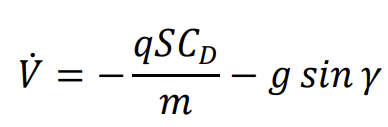
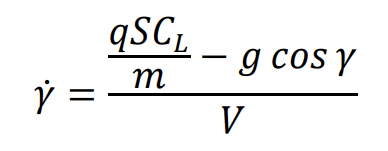
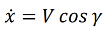
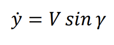
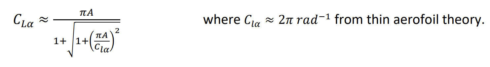
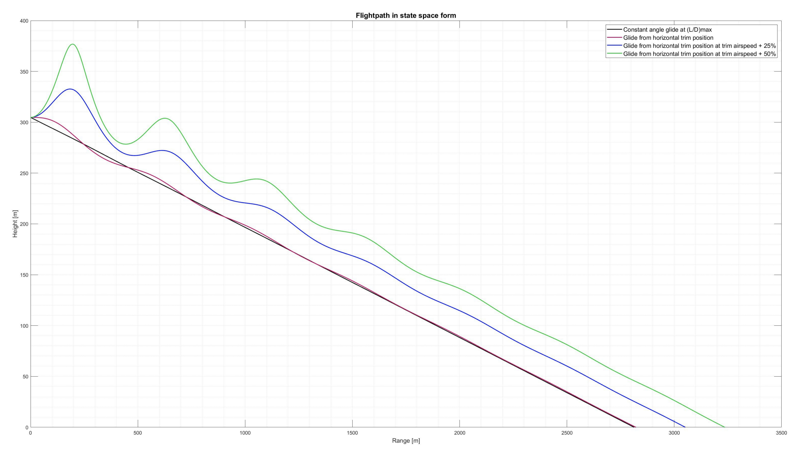
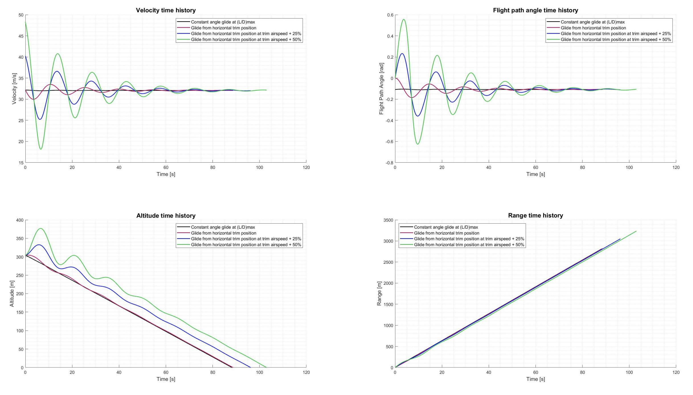

# Aircraft Longitudinal Dynamics Simulation

## Project Overview

This MATLAB project simulates the longitudinal flight dynamics of a Cessna 152 in a power-off glide. The simulation uses non-linear ordinary differential equations (ODEs) to model the aircraft's trajectory, focusing on velocity, flight path angle, altitude, and range.

---
## How to Run the Simulation

1. Clone this repository and ensure all files are in the same directory.
2. Run `lab3_script.m` in MATLAB.
3. Generated figures will appear in the MATLAB workspace and can be saved if needed.
 
---

## Files Included

1. **lab3_function.m**: Implements the ODEs governing longitudinal dynamics in state variable form.
2. **lab3_function_trim.m**: This function calculates the trimmed flight conditions for steady, level flight. It determines the trim airspeed (𝑉trim) and trim angle of attack (𝛼trim), which serve as the starting point for simulations. These are important for establishing the baseline conditions used to analyze dynamic responses to perturbations.

3. **lab3_script.m**: This script executes the simulation by solving the non-linear ODEs for longitudinal dynamics under different flight conditions. It:

- Initializes the state variables from trim conditions.
- Runs the simulation for scenarios like constant glide angle and varying initial airspeeds.
- Generates plots of velocity, flight path angle, altitude, and range time histories.

---

## Background and Equations

### Governing ODEs

The simulation is governed by the following ODEs:

1. Velocity Equation:
   

2. Flight Path Angle Equation:
   

3. Horizontal Position Equation:
   

4. Vertical Position (Altitude) Equation:
   

Where:
- \(V\): Velocity (m/s)
- \(\gamma\): Flight path angle (rad)
- \(x\): Horizontal position (m)
- \(y\): Altitude (m)
- \(C_L, C_D\): Coefficients of lift and drag
- \(\rho\): Air density (kg/m³)
- \(S\): Wing area (m²)
- \(m\): Aircraft mass (kg)
- \(g\): Gravitational acceleration (9.81 m/s²)

#### Lift Curve Slope

The lift curve slope for an untapered rectangular wing of finite aspect ratio can be approximated based on an elliptical loading distribution as:

---

## Simulation Scenarios

The simulation computes glide profiles for the following conditions:

1. **Constant angle glide at \( L/D_{max} \):**
   - Assumes the maximum lift to drag ratio for minimum descent angle.

2. **Glide from horizontal trim position:**
   - Starts with trim velocity and angle.

3. **Glide from horizontal trim position at trim airspeed +25%:**
   - Initial velocity is 25% higher than the trim speed.

4. **Glide from horizontal trim position at trim airspeed +50%:**
   - Initial velocity is 50% higher than the trim speed.
---

## Results

### Simulation Outputs
The following plots were generated for each flight scenario:
1. Velocity Time History
2. Flight Path Angle Time History
3. Altitude Time History
4. Range Time History
5. Flightpath in State Space Form (Altitude vs. Range)

### Parameters for Results:
- Aircraft: Cessna 152
- Wing Area (\(S\)): \( \sim 14.9 \, m^2 \)
- Aspect Ratio (\(AR\)): Typical for Cessna 152
- Air Density (\(\rho\)): Sea-level standard (\(1.225 \, kg/m^3\))
- Gravitational Acceleration (\(g\)): \( 9.81 \, m/s^2 \)
- Initial Altitude (\(y_0\)): \( 305 \, m \)

---

### Resulting figures

#### Flightpath in State Space Form

#### Time Histories
The image below shows the time histories of velocity, flight path angle, altitude, and range for all scenarios.

